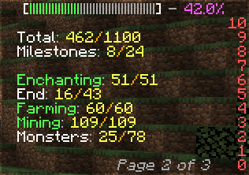

# MCDatapack.BacapTracker
A generic Minecraft Datapack for tracking BlazeandCave's Advancements Pack (BACAP) with a fancy Scoreboard.

For Minecraft 1.13 to 1.20 and more.

# Supported versions of BACAP
- :heavy_check_mark: Singleplayer
- :arrow_forward: Multiplayer
    - :x: Without Cooperative Mode
    - :heavy_check_mark: With Normal Cooperative Mode
    - :construction: With Team Cooperative Mode
- :heavy_check_mark: Hardcore Version
- :heavy_check_mark: Terralith Version
- :x: Infinity Snapshot Challenge

# Features
- Tracks the progress of all tabs and milestones of BACAP.
- Displays the progress of the current tab in the sidebar.
- Highly customizable pagination system.
- Only for 1.18+: Maintains a leaderboard that ranks the "First Advancements" score of players.

# In-game

### Screenshots

### Commands

- Use `/trigger bac_leaderboard` to see the ranking of "First Advancements".
- Use `/scoreboard players set page_increment [bac_tracker.]vars XXX` to change the time (in ticks) between each page flip, defaults to 200. `bac_tracker.` may or may not be present depending on you Minecraft version.
- Use `/scoreboard players set update_increment [bac_tracker.]vars XXX` to change the time (in ticks) between each update of the scores, defaults to 20. You may increase this number if you experience tick latency.
- Use `/scoreboard players set update_increment bac_leaderboard.vars XXX` to change the time (in ticks) between each update of the ranking, defaults to 60. Particularly tick-intensive if many players are connected, you may increase this number if you experience tick latency.

# Installation
See [this tutorial](https://minecraft.fandom.com/wiki/Tutorials/Installing_a_data_pack) for installing the datapack to your minecraft world.
If downloaded from source code, you need to generate the datapack using the included Python script before installing it. Otherwise if it was downloaded from the [release tab](https://github.com/Juloos/MCDatapack.BacapTracker/releases) then nothing has to be done, it is already generated.

# Requirements
[Python 3](https://www.python.org/) is required if you want to generate the datapack.

# Usage

    python3 ./BacapTracker/generate.py* [<path_to_bacap>]

_\* you can simply double-click the file on Windows._

The path must lead to a BACAP datapack directory or zip file, both ways must be the direct parent of `data` inside BACAP.

Dragging the file onto `generate.py` in Windows will have the same effect. If no path is provided, the script will ask for it interactively.

# Configuration
The Python script uses a [configuration file](BacapTracker/config.json) to allow customization of the generated datapack. Here is a list of the available options and their meaning:
- `Tabs` (*Object*) : translates the BACAP ressource location of tabs into human-friendly names. Use this to localize the names into your language. You shall only modify the names and not the ressource location, <u/>names must exclude space characters.</u>
- `Terralith` (*Boolean*) : if true, the script will take into account Terralith-related advancements for a three compatibility with Terralith, Nullscape and Amplified Nether. <u/>No need to provide the compatibility datapack of BACAP, the script still only uses the main datapack to generate.</u>
- `Hidden advancements` (*Boolean*) : if true, the script will take into account the hidden advancements of the different tabs.
- `Sidebar` : contains the following options, related to the scoreboard's sidebar.
    - `Progress bar.length` (*Integer*) : length of the progress bar, which is displayed in the sidebar's title. 40 is recommanded, a lesser value may break the indentation of other tabs.
    - `Pinned tabs` (*Array of strings*) : contains the ressource location of tabs to pin to the top of the sidebar, in order. Pinned tabs will always be on display through all pages.
    - `Tab count per page` (*Integer*) : number of tabs to display per page. The last page may contain less tabs than this value. Value 0 indicates that the script must compute it.
    - `Page count` (*Integer*) : number of pages to generate. Value 0 indicates that the script must compute it.
    - `Fallback.Tab count per page` (*Integer*) : when computing the number of tabs per page, if the result is not satisfying enough according to the algorithm then this value is used instead. <u/> Must be greater than 0.</u>
    - `Fallback.Max page count` (*Integer*) : when computing the number of tabs per page, this value is the upper bound the algorithme should take into account. <u/> Must be greater than 0.</u>
    - `Use custom pages` (*Boolean*) : if true, the script will use the `Pages` option to generate the pages. If false, the script will compute it using the other options.
    - `Pages` (*Array of arrays*) : contains the ressource location of tabs to display on each page, where one array represents one page. Use 'BLANK' to insert a blank tab and 'PAGE_INFO' to insert the pagination tab. If `Use custom pages` is set to true then this option describes the content of each page, otherwise it is ignored.

# References
BlazeandCave's Advancements Pack: https://www.planetminecraft.com/data-pack/blazeandcave-s-advancements-pack-1-12/
